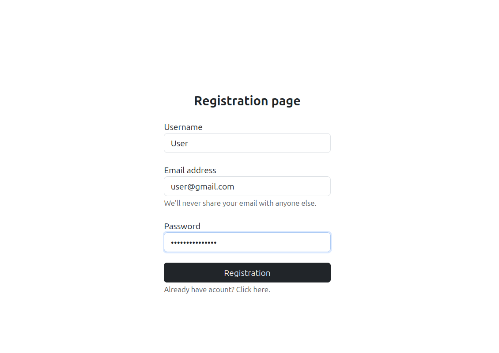
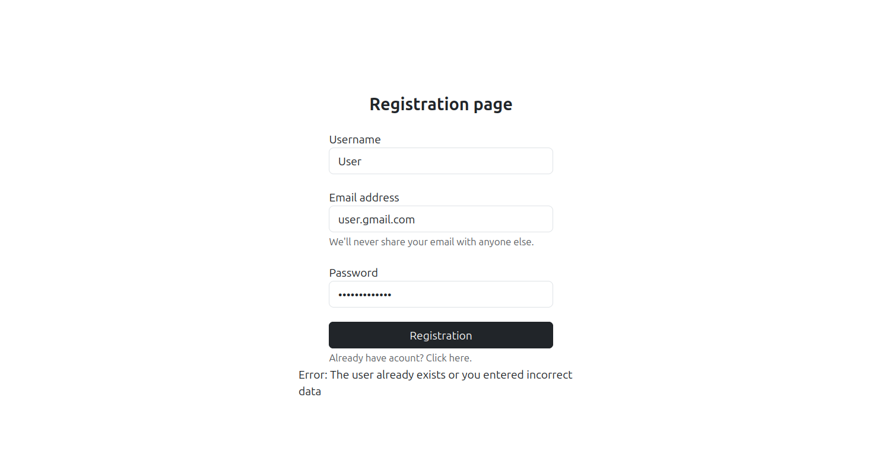
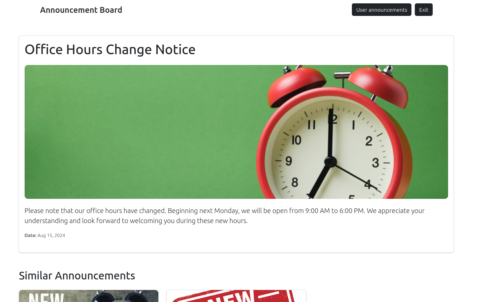
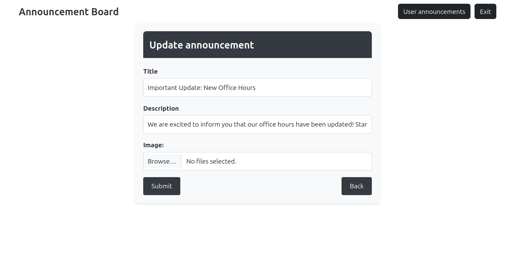
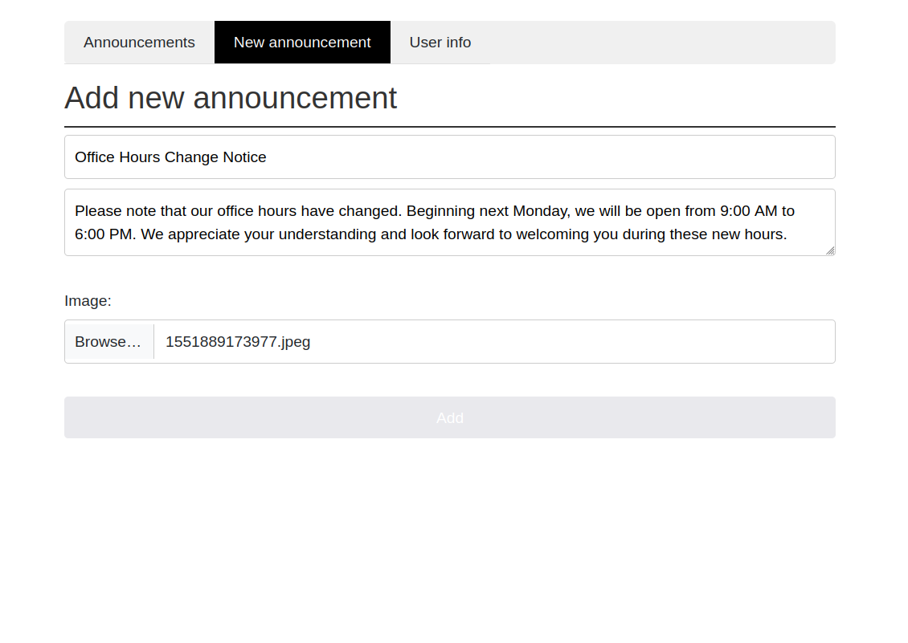

# Nerdysoft.TestTask

## Structure
- [About Project](#about-project)
- [Used Technologies](#used-technologies)
- [Run program](#run-program)
- [User Instruciton](#user-instruction)

## About Project

- This app was written for a test task at Nerdysoft for a .Net position

- Features:
    * Jwt Token used

    * Unit Of Work and Base Repository patterns used

## Used technologies

- ASP.NET 8

- Angular v18

- PostgreSQL v16

- Bootstrap v5

## Run program
#### Frontend part

Go to the web-layer folder and type:
```
npm install
```
Then type:

```
npm start
```

#### Backend part
Go to the AnnounceBoard.API folder and type:

```
dotnet watch run
```

## User Instruction

- The application will get started in (http://127.0.0.1:4200)

- Register or log in using your existing data (it may take a few seconds to load)


- Use valid data:
  * email address must contain @gmail.com or another valid domain
  
  * password must contain at least 8 characters

  


- Home page where announcements are posted
  

- Click on an announcement to view detailed information about it


-CLick on the *Edit* button to edit an announcement



- Click on the *User announcements* tab button to view a list of announcements you have posted


- Click on *New announcement* to post new announcement



- To exit click on *Exit* button